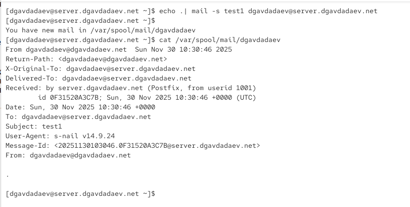
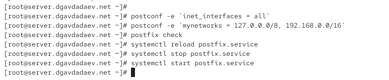
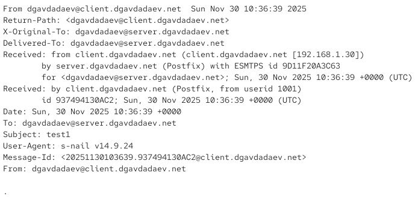
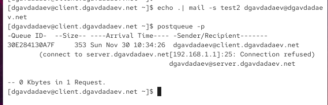
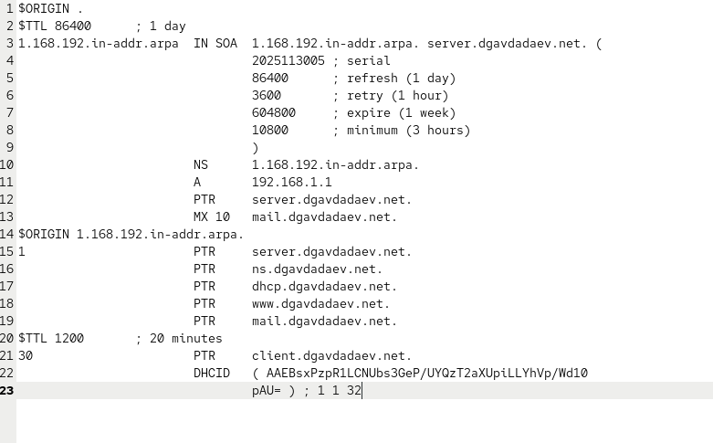

# Цель работы

## Основная цель

Приобретение практических навыков по установке и конфигурированию SMTP-сервера Postfix.

# Ход выполнения

## Установка Postfix и настройка firewall

{width=85%}

## Настройка myorigin и mydomain

{width=85%}

## Продолжение настройки параметров

{width=85%}

## Мониторинг лога и отправка локального письма

{width=85%}

## Продолжение мониторинга

{width=85%}

## Установка Postfix на клиенте

{width=85%}

## Настройка inet_interfaces и mynetworks

{width=85%}

## Успешная доставка после изменения mynetworks

{width=85%}

## Письмо, отправленное на доменный адрес без MX

{width=85%}

## Очередь Postfix при ошибке доставки

{width=85%}

## Логи о недоставке

{width=85%}

## Файл прямой зоны с MX-записью

{width=85%}

## Файл обратной зоны

{width=85%}

## Логи успешной доставки

{width=85%}

## Полученное письмо после исправления MX

{width=85%}

# Итоги

## Вывод
- Настроена почтовая система Postfix для локальной сети и доменной доставки  
- Реализована отправка писем между клиентом и сервером  
- Настроены MX и PTR-записи  
- Проверена доставка писем и работа очереди Postfix  
- Добавлена автоматизация конфигурации через Vagrant provisioning
